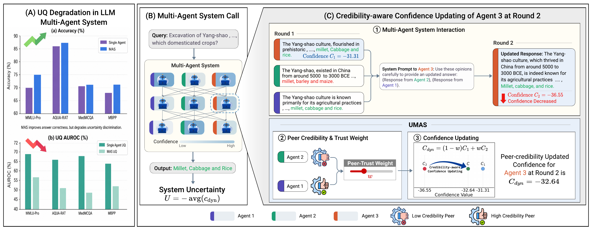

# UMAS: System-Level Uncertainty Quantification for Multi-Agent LLM Systems (NeurIPS 2026)

Hanwen Li, Jinhao Duan, Xiaoshuang Shi, Yue Zhang, Tianlong Chen, Kaidi Xu, Chenxi Yuan

This is the official implementation of the NeurIPS 2026 paper
[*UMAS: System-Level Uncertainty Quantification for Multi-Agent LLM Systems*](https://dby52-04.github.io/assets/files/UMAS_NeurIPS2026.pdf).



## Usage

Requires Python 3 (tested with 3.11).

```bash
pip install -r requirements.txt
python src/run.py data/debate_gpt-4o-mini_aqua-rat.json.gz
```

The output is AUROC (%) for predicting whether the final answer is correct.

## Dataset format

A gzip-compressed JSON file with one MAS run on one benchmark:

```jsonc
{
  "trajectories": [
    {
      "correct": true,            // whether the MAS's final answer is correct
      "nodes": [
        {
          "id": 0,                // unique within the trajectory
          "round": 0,             // parents must come from earlier rounds
          "agent": "agent_0",     // nodes of the same agent share this value
          "parents": [],          // ids of the nodes this node read; [] = initial node
          "logprobs": [-0.01, -0.3]  // token log-probabilities of the node's output
        }
      ]
    }
  ]
}
```

The example file is LLM Debate (3 agents, 2 rounds plus an aggregator) with GPT-4o mini on 190
AQUA-RAT questions. It also stores the question, the answer and each node's output text.

## Citation

```bibtex
@inproceedings{li2026umas,
  title     = {{UMAS}: System-Level Uncertainty Quantification for Multi-Agent {LLM} Systems},
  author    = {Li, Hanwen and Duan, Jinhao and Shi, Xiaoshuang and Zhang, Yue and Chen, Tianlong and Xu, Kaidi and Yuan, Chenxi},
  booktitle = {Advances in Neural Information Processing Systems (NeurIPS)},
  year      = {2026}
}
```
